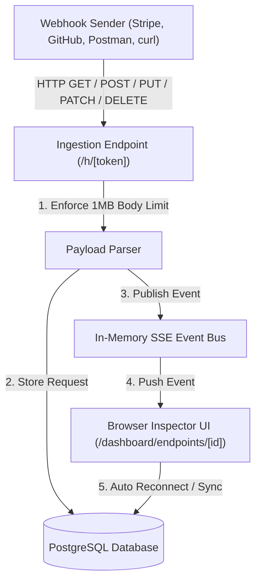

# WebhookLab

> Webhook debugging without the guesswork.

WebhookLab is a developer-focused webhook debugging platform that generates temporary HTTP endpoints, captures incoming requests, stores them in PostgreSQL, and pushes them live to a developer interface in real time.

---

## 🏗 Architecture



---

## ✨ Features

- **Public Webhook Ingestion (`/h/[token]`)**: Secure random 96-bit entropy tokens (`/h/<24-hex-token>`). Supports GET, POST, PUT, PATCH, DELETE.
- **Payload Limits**: 1 MB payload restriction (`1,048,576` bytes).
- **Safe Parsing**: Gracefully parses `application/json`, `application/x-www-form-urlencoded`, `text/plain`, and malformed JSON payloads.
- **Realtime Updates**: Server-Sent Events (SSE) push incoming requests instantly to the dashboard without page refreshes. Reconnect and tab-focus synchronization ensures state accuracy.
- **Header Redaction**: Sensitive headers (`authorization`, `cookie`, `set-cookie`, `x-api-key`, `api-key`, `bearer`) are masked in the UI and clipboard copy actions.
- **Varnus Integration**: Uses Varnus `JsonInspector` and `RequestResponseViewer` components for HTTP inspection.
- **SSRF Threat Safeguards**: Explicit validation preventing replay attacks targeting loopback (`127.0.0.0/8`, `::1`), private networks (`10.0.0.0/8`, `172.16.0.0/12`, `192.168.0.0/16`), link-local (`169.254.0.0/16`), and cloud metadata endpoints (`169.254.169.254`).
- **Request Replay**: Re-send captured webhook requests to external destination target URLs.
- **Request Retention Policy**: Automatically keeps the latest 100 requests per endpoint to avoid unbounded database growth.

---

## 🛠 Tech Stack

- **Framework**: Next.js 16 (App Router, Turbopack)
- **Language**: TypeScript
- **Database & ORM**: PostgreSQL + Drizzle ORM
- **Styling & UI**: Tailwind CSS v4, shadcn/ui, Lucide Icons, next-themes (Dark & Light Mode)
- **Varnus Components**: `json-inspector`, `request-response-viewer`
- **Runtime & Tooling**: Bun, `bun test`

---

## 🚀 Local Setup Guide

### 1. Prerequisites
Ensure you have Bun and PostgreSQL installed and running:
```bash
brew services start postgresql@17
```

### 2. Install Dependencies
```bash
bun install
```

### 3. Environment Setup
Create a `.env.local` file:
```bash
cp .env.example .env.local
```

Ensure `.env.local` contains:
```env
DATABASE_URL="postgres://127.0.0.1:5432/webhooklab"
NEXT_PUBLIC_APP_URL="http://localhost:3000"
```

### 4. Database Setup & Migrations
Create the PostgreSQL database and push the Drizzle schema:
```bash
psql -h 127.0.0.1 -d postgres -c "CREATE DATABASE webhooklab;"
bunx drizzle-kit push
```

### 5. Run Development Server
```bash
bun run dev
```
Open [http://localhost:3000](http://localhost:3000) in your browser.

---

## 🧪 Testing with `curl`

1. Open WebhookLab at `http://localhost:3000/dashboard` and click **Create Endpoint**.
2. Copy your generated webhook URL (e.g., `http://localhost:3000/h/d02b442d36a1a88d73136174`).
3. Send a test webhook:

```bash
curl -X POST "http://localhost:3000/h/<your-token>?env=dev" \
  -H "Content-Type: application/json" \
  -H "Authorization: Bearer secret_key_123" \
  -H "X-Test-Header: webhooklab" \
  -d '{
    "event": "payment.completed",
    "id": "evt_123",
    "amount": 2499,
    "currency": "INR"
  }'
```

4. Watch the request appear live in the WebhookLab browser dashboard!

---

## 🔒 Security Considerations

1. **Token Entropy**: Tokens use `crypto.randomBytes(12).toString("hex")` providing 96 bits of cryptographic entropy, preventing brute-force token enumeration.
2. **Payload Size Capping**: Ingestion endpoints reject payloads exceeding 1 MB (`413 Payload Too Large`), preventing memory exhaustion attacks.
3. **SSRF Replay Mitigation**: Destination targets are resolved via DNS and checked against RFC1918, loopback, and metadata ranges. HTTP redirects are handled manually to prevent redirect-based SSRF into private subnets.
4. **Data Redaction**: Sensitive authorization headers are redacted before UI rendering or copying.

---

## 📄 License

MIT
